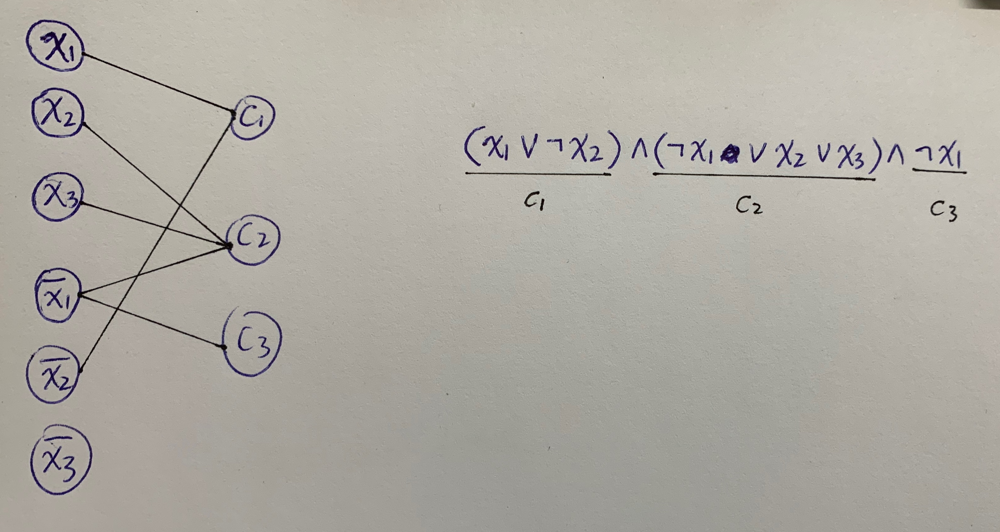

**Live notes as I learn to understand the paper.**

- [1. Basics of SAT (Wiki)](#1-basics-of-sat-wiki)
  - [1.1 Definition and terminology](#11-definition-and-terminology)
  - [1.2 The Boolean Satisfiability Problem (SAT)](#12-the-boolean-satisfiability-problem-sat)
  - [1.3 Graph representation: CNF to LCG (Literal-Clause Graph)](#13-graph-representation-cnf-to-lcg-literal-clause-graph)
- [2. Store a CNF problem using the DMACS .cnf format](#2-store-a-cnf-problem-using-the-dmacs-cnf-format)

# 1. Basics of SAT ([Wiki](https://en.wikipedia.org/wiki/Boolean_satisfiability_problem))

## 1.1 Definition and terminology

1. A **boolean expression/propositional logic formula** is bulit from:
   - Variables: `x_1`, `x_2`.
   - Conjunctions: AND, `∧`.
   - Disjunctions: OR, `∨`.
   - Negations: NOT, `¬`.
   - Parentheses: `(` `)`.

2. A **literal** could be a positive literal (正文字) `x`, or a negative literal (反文字) `¬x`.
   
   A **clause (子句)** is a disjuntion `∨` of literals (or a single literal). 用**或**连接。 
  
3. A formula is in **Conjunctive Normal Form (CNF)** if it is a conjunction `∧` of clauses (or a single clause). 用**与**连接。
   
   For example, `(x1 ∨ ¬x2) ∧ (¬x1 ∨ x2 ∨ x3) ∧ ¬x1` consists of 3 clauses.
   
   > Using the laws of Boolean algebra, every propositional logic formula can be transformed into an equivalent conjunctive normal form, which may, however, be exponentially longer.

## 1.2 The Boolean Satisfiability Problem (SAT)
1. SAT is the problem to determine whether a formula is satisfiable or not.
   
   A boolean formula is called "**satisfiable**" if there **exists** a set of `TRUE` or `FALSE` values assigned to each variable such that this formula is `True`. If no such assignment exists, then this formula is called "**unsatisfiable**".
   
   For example, by choosing `x1` = `FALSE`, `x2` = `FALSE`, and `x3` arbitrarily, the above formula is `TRUE`. So it is satisfiable. 

   > The problem is to determine whether there is any assignment of values to the Boolean variables which makes the formula true. It's something like trying to flip a bunch of switches to find the setting that makes a light bulb turn on.

2. SAT is the first problem that was proven to be NP-complete.

3. In the form of CNF, each clause must be `TRUE`.

4. > As of 2007, heuristic SAT-algorithms are able to solve problem instances involving tens of thousands of variables and formulas consisting of millions of symbols, which is sufficient for many practical SAT problems from, e.g., artificial intelligence, **circuit design**, and automatic theorem proving.

## 1.3 Graph representation: CNF to LCG (Literal-Clause Graph) 
Edge means including.




# 2. Store a CNF problem using the DMACS .cnf format 

[Reference: https://people.sc.fsu.edu/...](https://people.sc.fsu.edu/~jburkardt/data/cnf/cnf.html#:~:text=CNF%20Files-,CNF%20Files,example%20of%20the%20satisfiability%20problem)


> The CNF file format is an ASCII file format.
> 
> - The file **may** begin with comment lines. The first character of each comment line must be a lower case letter "**c**". Comment lines typically occur in one section at the beginning of the file, but are allowed to appear throughout the file.
> - The comment lines are followed by the "**problem**" line. This begins with a lower case "**p**" followed by a space, followed by the problem type, which for CNF files is "cnf", followed by **the number of variables** followed by **the number of clauses**.
> - The remainder of the file contains lines defining the clauses, one by one.
> - A clause is defined by listing the (positive, `+` omitted) index of each positive literal, and the **negative index** of each **negative** literal. Indices are **1-based**, and for obvious reasons the index 0 is not allowed.
> - The definition of a clause may extend beyond a single line of text.
> - The definition of a clause is terminated by a final value of "0".
> - The file terminates after the last clause is defined.

Still using the above example with 3 variables and 3 clauses (`n_var` = 3, `n_c` = 3):

```python
p cnf 3 2
1 -2 0
-1 2 3 0
-1 0
```

To convert it into a graph, first think about the nodes:
- positive literals: 1, 2, 3.
- negative literals: `abs(-1) + n_var =` 4, 5, 6. 
- clauses: `2 * n_var + 1` = 7, 8, 9.